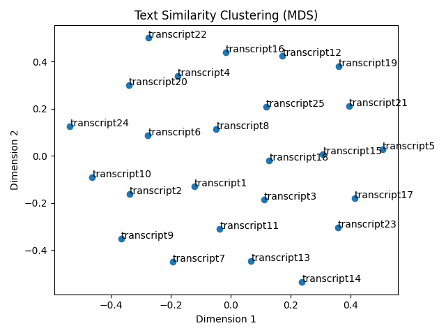

# Text-Analysis-Project
## Project Overview: 
In short this project takes cold call transcripts, stores them locally in a clean data structure and conducts basic text analysis across each transcript. This analysis helps make the transcripts more navigable by highlighting word similarities between calls. This is done both visually with a plot and a TF-IDf computation. The hope is that in practice this would allows sales reps to easily navigate to similar calls and see how their peers or other accounts are being handled. 

Of course because I no longer have access to a Sales Dialler API I wrote a program to generate somewhat realistic JSON payloads to mimic what a real API might output (See Pt. 1 Code). 

## Implementation Overview
### Code for Part 1:
- Mock the fetching of cold-call transcripts
- Use OpenAI and Python to create dummy cold-call transcripts based on what Salesloft Transcript API requests might create
    - Metaprompted to create a prompt that the generates high quality (realistic) transcripts
    - Use OpenAI's Structured Outputs to ensure JSON adherence in the responses
- Write generated transcripts to local files under the /data directory

**Synthetic Data Creation:**  
    
    # of possible unique prompts =
    outcomes (4) × industries (6) × personas (6) × current_stacks (6) × triggers (6) × tones (5) × tech_objections (4) × biz_objections (4) = 414,720
Note: This doesn't factor in the variations from temperature, so in reality there are even more variations of response!

### Code for Part 2:
- Load each JSON transcript into memory   
- Store and preprocess each transcript as a cleaned token list and frequency dictionary to support both sequential and statistical text analyses 
- Compute TF IDF using guidance from [this Medium article](medium.com/bitgrit-data-science-publication/tf-idf-from-scratch-in-python-ea587d003e9e). I tried to memoize by caching IDF Values
- Create Wordclouds for each document and store in Outputs File
- Build a cosine-similarity matrix across all transcripts using sklearn’s DictVectorizer and pairwise_distances
- Use "Multidimensional Scaling" to project similarity matrixes into two dimensions and plot documents. This shows which calls share similar word usage

### Design rationale behind my cleaned text data structure
My program at the highest levels ingests call transcripts (JSONs), cleans and normalizes the conversation, summarizes word content and then visualizes document similarity. At a more granular level: each file’s sentences are tokenized into individual words, then these are cleaned. The cleaning process lowercases, strips punctuation/dashes, and removes NLTK stopwords alongside supplemental domain-specific terms. This cleaned data per record is then stored in a two-component dictionary with a list of the ordered text and the individual word counts. This means that downstream steps can compute metrics on the text (like: average token length) and quickly calculate frequency metrics (TF,IDF & TF-IDF) without needing to continously re-parse. 

Alongside this datastructure another key design decision was whether to base similarity on raw counts or TF–IDF (me and GPT argued heavily on this). While raw counts keep the implementation simple, transparent and most importantly legible for me. They do overemphasize common terms. The approach reccomended to me by my AI companion was to use a TF–IDF (with a "precomputed corpus-level IDF map"). This would highlights distinctive vocabulary and yield cleaner clusters. A key learning I had during this project was that as I code I need to understand that I might have to make certain sacrifices in efficency compared to AI reccomendations to keep the code understandable to me. Afterall this allows me to debug quicker and better interpret the outputs of my program. Hence why I used raw counts for my 2d plot instead of TF-IDF (or SKLearns TF-IDF tools). 

Some other tradeoffs include assuming specifed filenames vs indexing into the data folder and pulling file names dynamically for robustness, and using a simple regex/tokenizer for speed vs more complex NLP libraries that might support richer normalization. 

## Results: How this program could be used IRL
I'm quite happy with how this program turned out overall. I think the program outputs speak for themselves, the MDS plot is a useful tool to quickly see which calls are similar. So if a rep were to complete call 19 they could navigate to the deal associated with call 21 (see plot below) and see how that deal was handled. The idea is that because the similarity was computed usign similar words both deals likely have some sort of overlap, like the prospect's tech stack or the prospect's current objections. This is further represented by the TF-IDF summaries which almost give a 3 word summary of each transcript by displaying the unique distribution of words being used in that call, which likely correlate to that deal's unique components.    

## Reflection
### Prompting and AI use
Alongside my various in-line comments on AI usage please see this [link](docs.google.com/document/d/14gsQMn0RI0pTZ-Sm5sbLG2_3RlNS0I5rl2IksnXsSeE/edit?tab=t.0) to get insight into some of the prompts I used and how I co-built with ChatGPT to ensure I was writing legible and code I understood. As I lightly touched on above, this project helped me realize the importance of balancing AI efficient code with code that I understand and comprehend. Sometimes excessive GPT usage can easily guide to code that feels understandable but really isn't. I ran into this and needed to put extra time and effort into breaking down/simplifying my 2D plotting function. 

# Thoughts for the future:
While my program for generating transcripts was a great way to generate synthetic data for this project I still think the calls could have some more variation and the prospects could object with a little more intensity (realistic from my experience). Luckily though, most sales organizations have millions of minutes worth of call transcripts that could be piped into a program like this. Hence why the API like document format should allow me to integrate into a real API with only minor adjustments made to the code that moves data to local memory. 

I also hard coded names (Zhi and Arjun for fun) into the prompt so that the TF-IDF calculations wouldn't flag names. In the case of using a real API I'd use meta info from the CRM to add company names and individual names to the domain words we removed. 

Finally, while one of my goals was to make it easier for reps to navigate to similar calls and in turn identify similar deals they might use for inspiration, another was to auto create an email to send to the prospect after the call. This would've been done with more GPT API calls. Unfortunately I ran (far) over time and as a result will have to reserve this feature for another day. Maybe the same day I wire in a real Dialler API...   